# ArgoCDP2 – GitOps Continuous Deployment on Amazon EKS

## Project Overview

ArgoCDP2 demonstrates a GitOps-driven Continuous Deployment pipeline built on Amazon Elastic Kubernetes Service (EKS) using Argo CD.  
This project showcases infrastructure automation, version-controlled deployments, and declarative GitOps workflows — aligning with DevOps and DevSecOps best practices.

### Objective

To automate application deployments and configuration management on Kubernetes using Argo CD, ensuring:

- Single source of truth: Git repository governs cluster state  
- Secure delivery: Least-privilege Kubernetes RBAC and secret management  
- Observability and rollback: Continuous sync, self-healing, and versioned rollbacks  

---

## Architecture Explanation

### Architecture Diagram

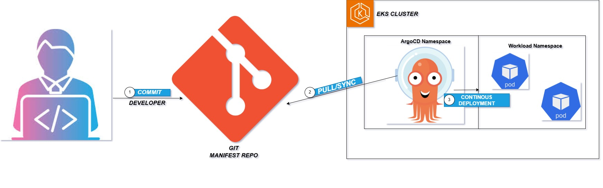 
*Source diagram: ArgoCDP2.drawio*

### Workflow Breakdown

1. **Developer Commit:**  
   The developer pushes Kubernetes manifests or Helm charts to the Git manifest repository.

2. **Argo CD Pull/Sync:**  
   Argo CD continuously monitors the Git repository for changes and automatically syncs them to the EKS cluster.

3. **Continuous Deployment:**  
   Updated configurations are applied to the workload namespace, automatically rolling out new pods or rolling back failed deployments.

This approach enforces a declarative deployment model and maintains auditability, consistency, and security by treating Git as the single source of truth.

---

## Step 1: Create and Configure the Amazon EKS Cluster

### Concept

EKS (Elastic Kubernetes Service) provides a managed Kubernetes control plane, allowing DevOps teams to focus on deploying workloads instead of managing cluster infrastructure.

### Instructions (AWS Management Console)

Instead of using the CLI, the EKS cluster was created directly through the AWS Management Console for better visualization and control.

- Navigate to the Amazon EKS service in your AWS Console.
- Click “Add cluster” → “Create”.
- Enter a cluster name (e.g., `argocd-eks-cluster`).

**Creating the EKS Cluster (Console Overview)**  
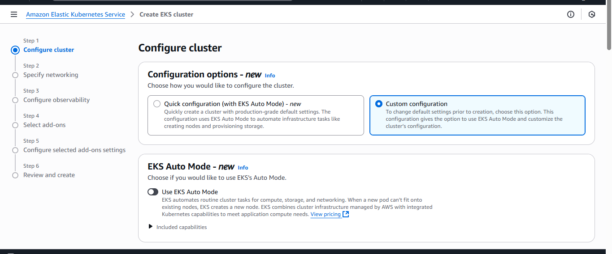

**Cluster Configuration Details**  
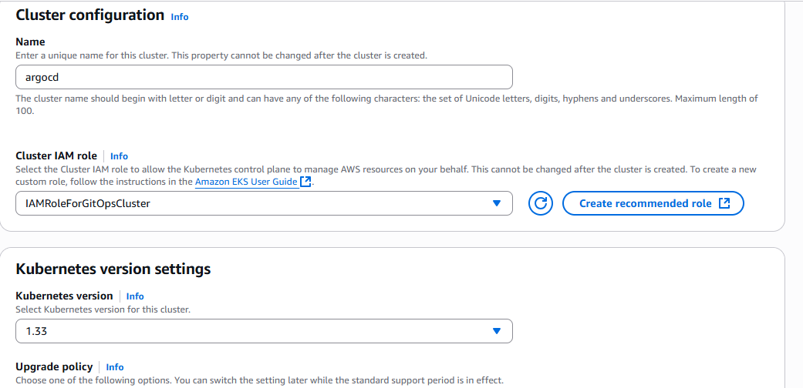

- Select the desired Kubernetes version (e.g., 1.29).
- Choose an existing IAM role with EKS permissions or create a new one.

**Final Cluster Creation Confirmation**  
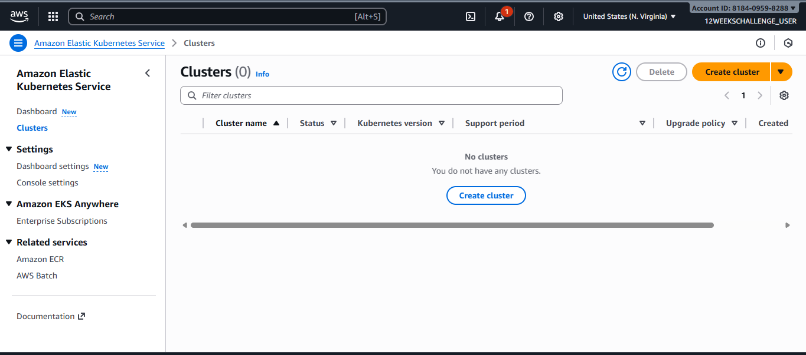

- Configure networking:
  - Select your VPC and subnets.
  - Allow public access for the Kubernetes API endpoint (for testing purposes).
  - Leave default logging and tag settings.
- Click “Create” and wait for the cluster status to show as Active.

---

## Step 2: Connect kubectl to the EKS Cluster

```bash
# Update kubeconfig to connect kubectl to the new cluster
aws eks --region us-east-1 update-kubeconfig --name argocd-cluster

# Verify cluster connectivity
kubectl get nodes
kubectl cluster-info
````

**Viewing All Namespaces in EKS**
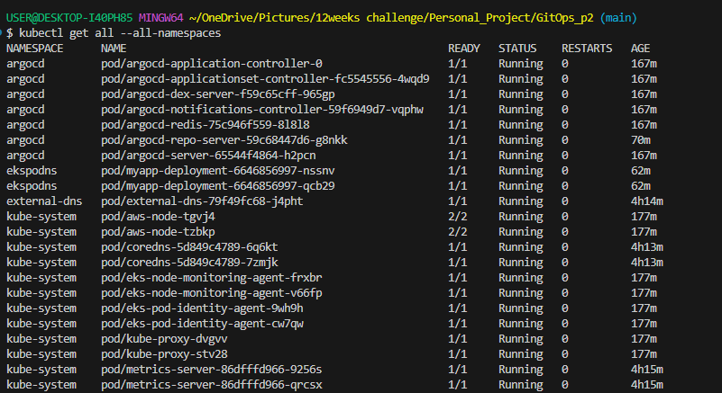

---

## Step 3: Create Argo CD Namespace

```bash
kubectl create namespace argocd
kubectl get ns
```

**ArgoCD Successfully Installed with Components**
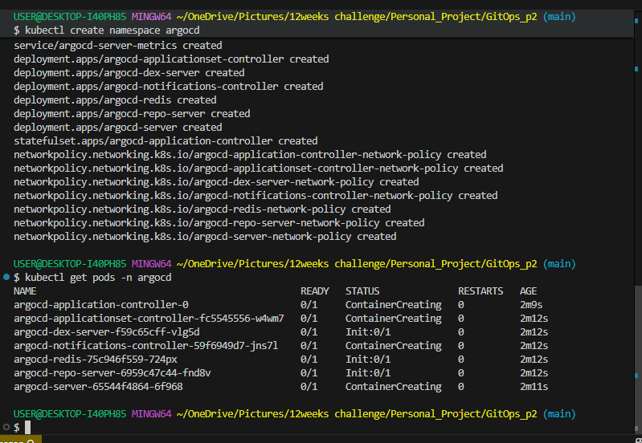

---

## Step 4: Install Argo CD

```bash
# Install Argo CD into the argocd namespace
kubectl apply -n argocd -f https://raw.githubusercontent.com/argoproj/argo-cd/stable/manifests/install.yaml

# Verify installation
kubectl get all -n argocd
```

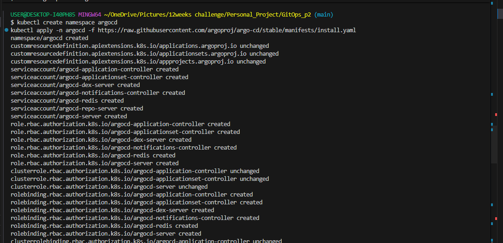

---

## Step 5: Expose Argo CD UI via Port-Forwarding

```bash
kubectl port-forward svc/argocd-server -n argocd 8080:443
```

Access the UI at: `https://localhost:8080`

**Checking Service IP and Type of ArgoCD Components**
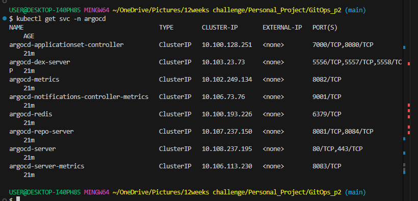

**Port Forwarding ArgoCD Service**
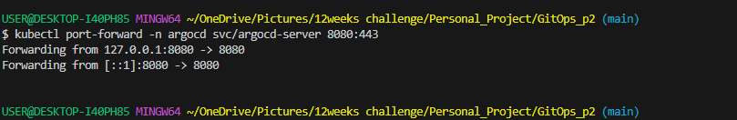

---

## Step 6: Retrieve and Decode Argo CD Admin Password

```bash
kubectl get secret argocd-initial-admin-secret -n argocd -o json
echo <password> | base64 --decode
```

Use the following credentials to log in:

* Username: `admin`
* Password: (decoded value above)

**Retrieving ArgoCD Admin Password**
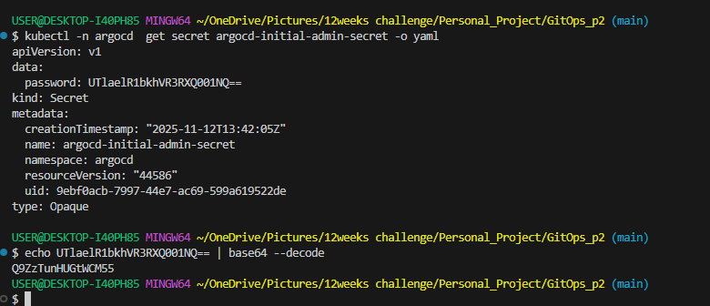

**Getting the ArgoCD Admin Password and Checking the Service**
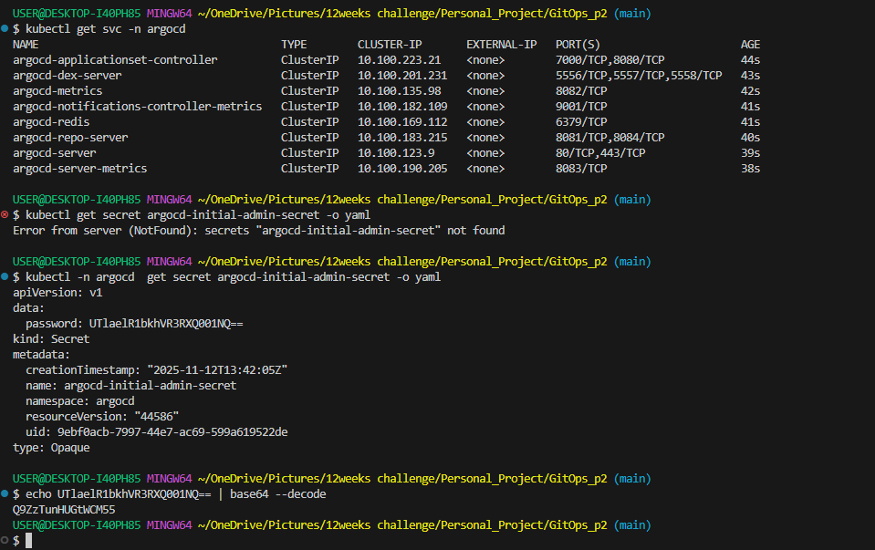

**Logging into ArgoCD**
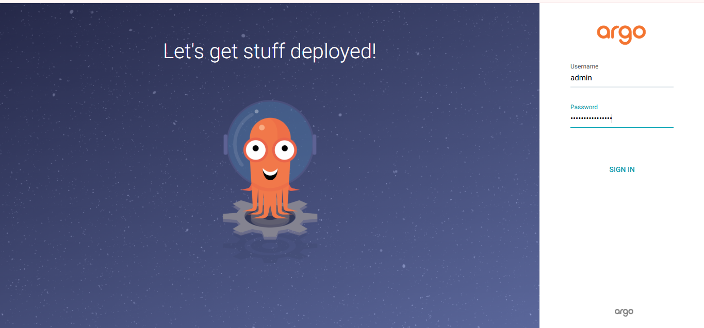

**ArgoCD Plain Dashboard View**
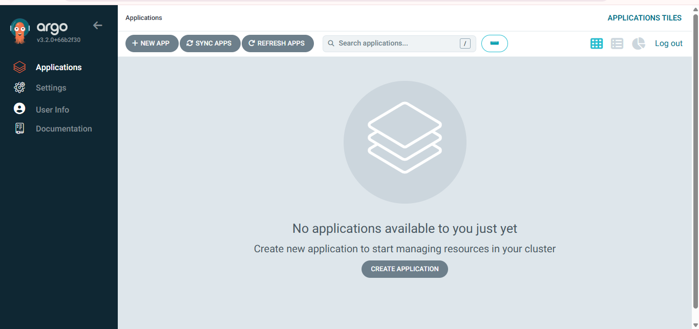

---

## Step 7: Deploy Application Using Application Manifest

```bash
kubectl apply -f application.yml
```

**Applying Kubernetes Manifests with kubectl**
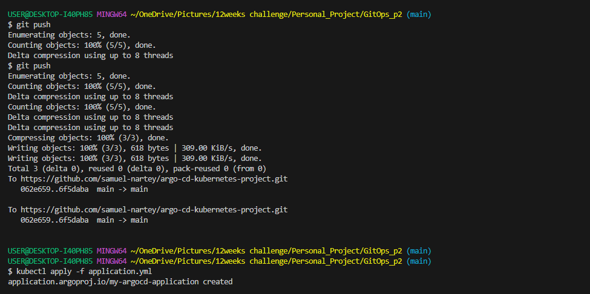

**Application Created in ArgoCD**


**ArgoCD Deployment Overview (Step 1)**
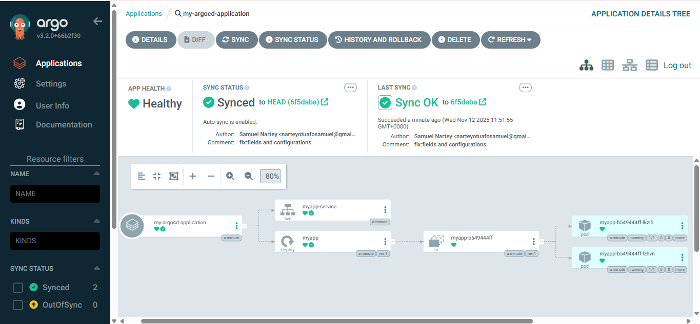

**ArgoCD Deployment Overview (Step 2)**
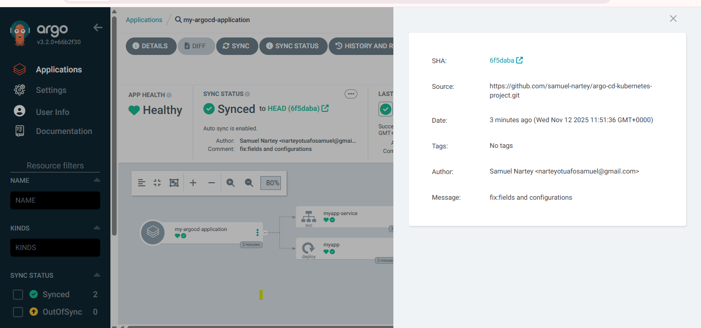

---

## Step 8: Test Argo CD Sync Policies

Argo CD supports Automated, Manual, SelfHeal, and Prune sync strategies.

**Scaling Policies and Self-Healing (Synchronization Behavior)**

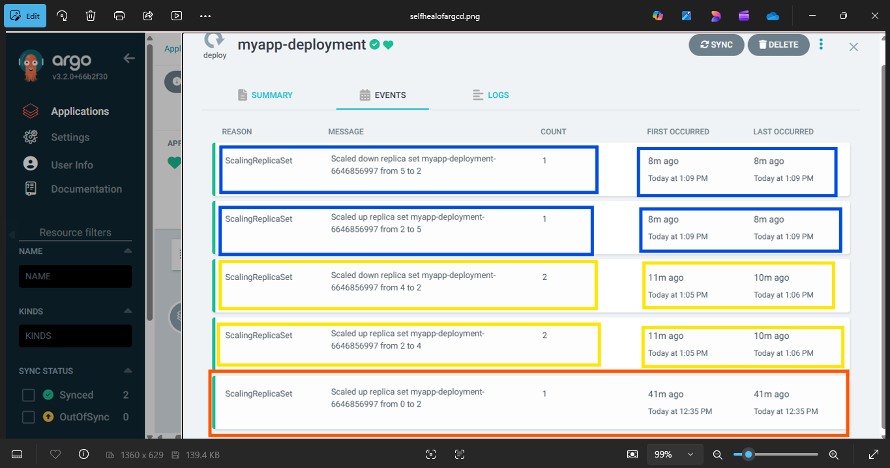

|  Color | Timeframe |                    Manual Change (Drift)                    |            ArgoCD's Response            |                      Effect                     |
| :----: | :-------: | :---------------------------------------------------------: | :-------------------------------------: | :---------------------------------------------: |
| Orange |  41m ago  | Initial deployment using `kubectl apply -f application.yml` |     Scaled up replica set from 0 → 2    |  Initial deployment based on Git desired state  |
| Yellow |  11m ago  |                    Manual change detected                   | Scaled down from 4 → 2 (then back to 4) | ArgoCD detected drift and reverted to Git state |
|  Blue  |   8m ago  |                    Manual change detected                   | Scaled down from 5 → 2 (then back to 5) | ArgoCD detected drift and reverted to Git state |

**Key Takeaways**

* ArgoCD enforces Git as the source of truth.
* Manual changes in the cluster are automatically reconciled.
* Permanent updates must be made in Git manifests.

---

## Cleaning Up Resources

* **Delete EKS Cluster**
  

* **Delete ArgoCD Node**
  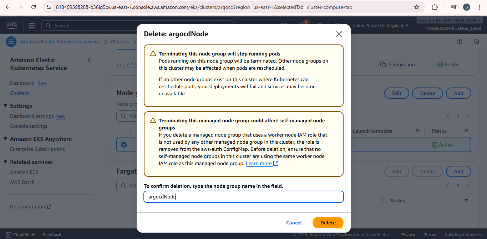

* **Delete Namespace and Verification**
  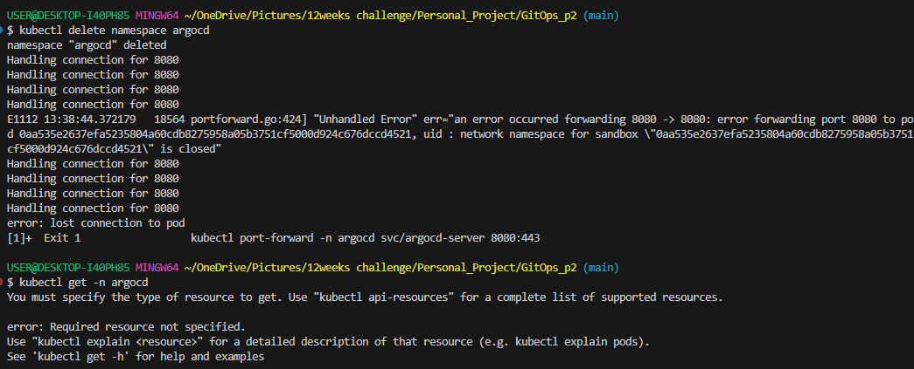

* **Editing Deployment to Test ArgoCD**
  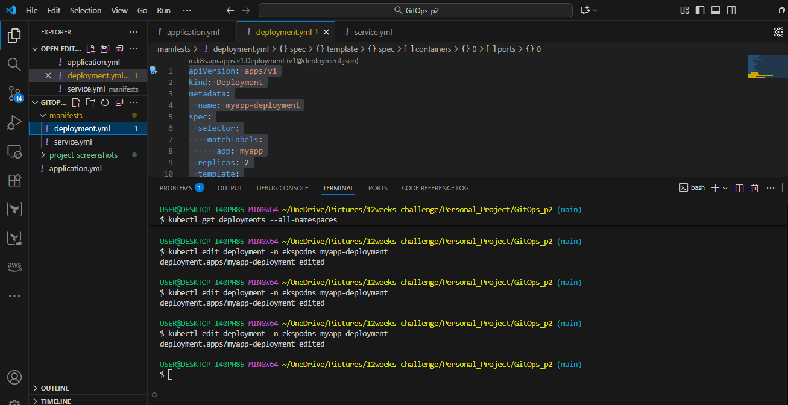

* **Editing Default ArgoCD Deployment Time**
  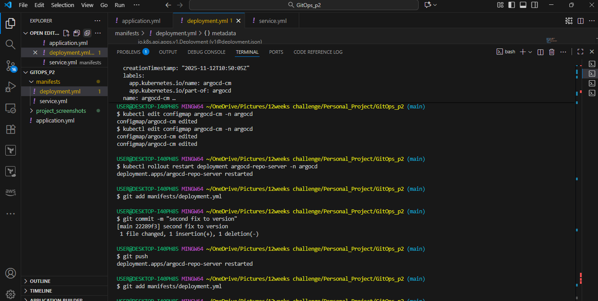

---

## Key Learnings and DevSecOps Perspective

* **Git as Source of Truth:** version-controlled and auditable deployments
* **Drift Management:** auto-restore desired state
* **Security:** RBAC & Git-safe secrets
* **Scalability:** multi-cluster GitOps architecture

---

## Tools and Technologies

| Category        | Tool/Service                    |
| --------------- | ------------------------------- |
| Cloud Provider  | AWS (EKS, IAM)                  |
| CI/CD           | Argo CD                         |
| Version Control | GitHub                          |
| IaC             | eksctl, kubectl                 |
| Security        | AWS IAM, RBAC, Base64 Secrets   |
| Observability   | Argo CD Dashboard, kubectl logs |

---

## Summary

This project illustrates a standalone EKS cluster GitOps workflow leveraging Argo CD’s capabilities to achieve secure, automated, and versioned deployments — aligning with DevOps and DevSecOps principles.

It demonstrates that Argo CD enforces Git as the single source of truth, automates deployments, and self-heals deviations, forming the foundation of modern, secure, and scalable Kubernetes delivery pipelines.

```
